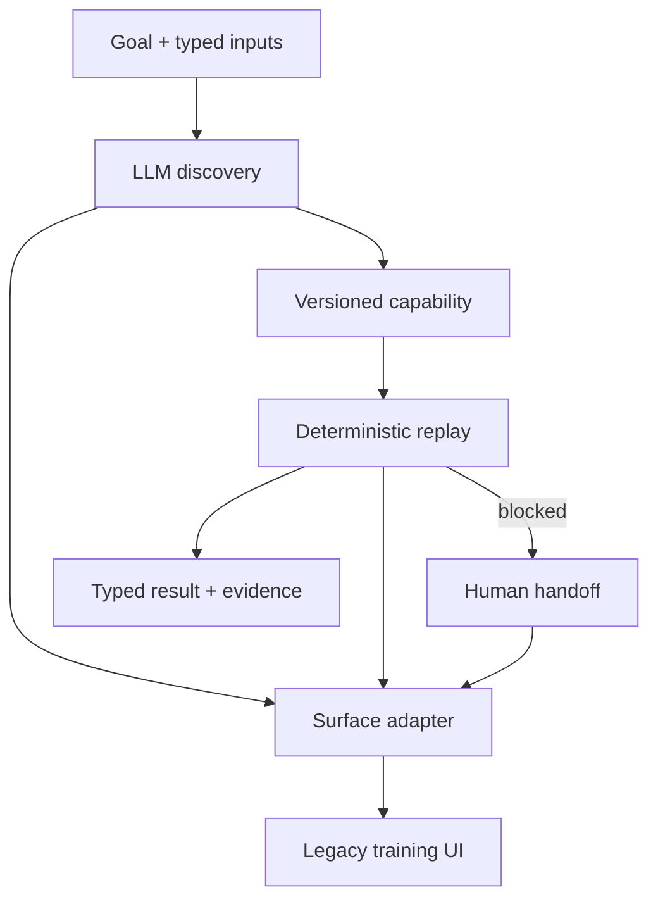

# Capability Forge

Discover once, replay deterministically. Capability Forge turns a successful LLM-driven interaction with a legacy UI into a typed, reviewable capability that can be invoked later without a model in the decision loop.

This repository is a focused implementation of the interface.ai computer-use assignment. It includes a deliberately awkward core-banking training UI, genuine LLM discovery, a versioned capability artifact, deterministic replay, explicit outcome and error handling, policy guardrails, structured evidence, and a same-session human intervention console.

> All names, accounts, and balances are synthetic training data. Do not use real customer information.

## What the demo proves

1. An LLM observes a live application surface and completes a natural-language goal.
2. The successful action sequence is compiled into a parameterized JSON capability.
3. A separate replay invokes that capability with a different member ID and no model calls.
4. `MEMBER_NOT_FOUND` is returned as an expected business outcome, not a crash.
5. A blocking supervisor-review state pauses replay, transfers the same browser session to a human, records the intervention, and resumes automation.
6. One capability runs across two tenant variants with explicit locator overrides.



## Requirements

- Node.js 20 or later
- npm
- Chromium installed by Playwright
- An Anthropic or OpenAI API key for the qualifying discovery run

## Setup

```bash
npm install
npx playwright install chromium
cp .env.example .env
```

Set one provider in `.env`, then export it in your shell. The CLI intentionally does not load `.env` implicitly, which keeps configuration behavior explicit:

```bash
export LLM_PROVIDER=anthropic
export ANTHROPIC_API_KEY=your_key_here
export ANTHROPIC_MODEL=claude-sonnet-4-5
```

OpenAI is also supported:

```bash
export LLM_PROVIDER=openai
export OPENAI_API_KEY=your_key_here
export OPENAI_MODEL=gpt-5-mini
```

No key is needed to run the deterministic replay path after an artifact exists.

## Exact demo path

### 1. Run genuine LLM discovery

```bash
npm run discover -- \
  --goal "Look up member M-1001 and return their current savings available balance" \
  --input memberId=M-1001 \
  --tenant harbor
```

This writes:

- `evidence/artifacts/member-savings-balance.v1.json`
- A structured discovery log and compiled capability under `evidence/discovery/`

The model is in the loop only during this step.

### 2. Replay with a different input and no model

```bash
npm run replay -- \
  --artifact evidence/artifacts/member-savings-balance.v1.json \
  --input memberId=M-2048 \
  --variant summit
```

Expected result:

```json
{
  "status": "success",
  "outputs": {
    "savingsBalance": 25004.01
  }
}
```

### 3. Exercise a known business outcome

```bash
npm run replay -- \
  --artifact evidence/artifacts/member-savings-balance.v1.json \
  --input memberId=M-9999 \
  --variant harbor
```

Expected status: `business_outcome` with code `MEMBER_NOT_FOUND`.

### 4. Exercise human handoff

```bash
npm run replay -- \
  --artifact evidence/artifacts/member-savings-balance.v1.json \
  --input memberId=M-1001 \
  --variant harbor \
  --scenario approval \
  --headed
```

Open `http://127.0.0.1:4311`, select **Take control**, dismiss the supervisor-review dialog by clicking it in the live session image, and select **Resume automation**. The intervention and operator actions are written to the replay evidence directory.

### Offline reviewer smoke path

```bash
npm run demo
```

This uses a clearly labeled scripted decision model only to verify local wiring without an API key. It is not presented as qualifying LLM discovery evidence. The checked-in evidence is produced by the genuine `discover` command.

## Result contract

Replay returns one of three top-level states:

| Status | Meaning | Example |
| --- | --- | --- |
| `success` | Checkpoint passed and all declared outputs were extracted | Savings balance returned |
| `business_outcome` | The application produced a legitimate domain result | `MEMBER_NOT_FOUND` |
| `failure` | Safety, system, targeting, or checkpoint failure | `PATH_NOT_ALLOWED`, `OUTPUT_MISSING` |

A failure identifies the step, expected state, observed problem when available, and failure evidence path.

## Safety model

- Exact origin and route allowlists are enforced before every action.
- Action types are allowlisted per capability.
- Risky and irreversible actions require configured blocking or human escalation.
- Input schemas are validated before navigation.
- Member identifiers, SSNs, credentials, tokens, and secret-like fields are redacted from persistent logs.
- Artifacts contain parameter placeholders, never concrete sensitive invocation values.
- The operator control plane has a single explicit owner: automation, human, or none.

This is a demonstration, not a complete production security boundary. Production deployment would add authenticated operator identities, encrypted session transport, tamper-evident audit storage, secrets management, tenant isolation, and formal artifact approval.

## Repository map

```text
src/agent/          LLM adapters, discovery loop, artifact compiler
src/app/            Legacy core-banking training application
src/core/           Typed schemas and result contracts
src/handoff/        Control ownership and operator console
src/observability/  Redacted JSONL evidence
src/policy/         Guardrail enforcement
src/replay/         Deterministic execution and error taxonomy
src/surface/        Browser surface abstraction
tests/              Unit and end-to-end vertical-slice tests
evidence/           Saved artifact and qualifying run evidence
```

## Quality checks

```bash
npm run check
npm run lint
```

The end-to-end suite covers cross-tenant replay, a known business outcome, and same-session human handoff.

## Design write-up

See [REPORT.md](./REPORT.md) for the required architecture, artifact, determinism, heterogeneity, handoff, safety, and cut-line decisions.
